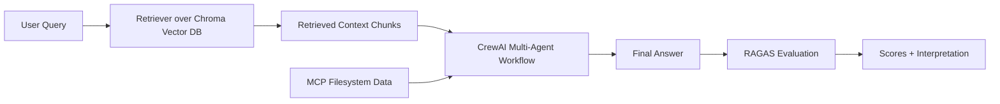
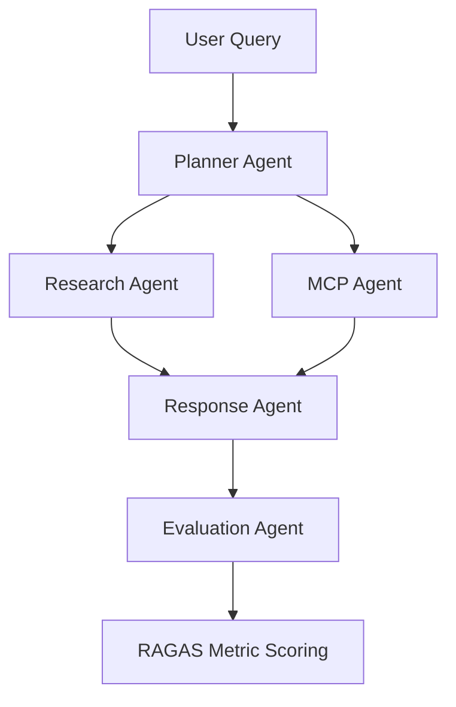

# Enterprise Knowledge Assistant (CrewAI + RAGAS + MCP)

## Project Overview
This project implements an **Enterprise Knowledge Assistant** that answers employee questions by combining:
- **RAG** over enterprise policy documents
- **CrewAI multi-agent orchestration**
- **MCP-integrated filesystem data access**
- **RAGAS quality evaluation**

## Business Problem
Enterprise knowledge is distributed across disconnected systems. Employees lose time finding accurate and current answers.  
This assistant unifies knowledge retrieval, system enrichment, and answer quality scoring in one workflow.

## Solution Flow
`user query → retrieval → agent collaboration → MCP enrichment → response generation → RAGAS scoring → final output`

## Architecture Diagram


## Agent Workflow Diagram


## CrewAI Design
### Agents
- **Planner Agent**: Breaks the query into evidence needs
- **Research Agent**: Extracts relevant RAG evidence
- **MCP Agent**: Extracts supplemental enterprise updates from filesystem MCP data
- **Response Agent**: Produces final user-facing answer grounded in evidence
- **Evaluation Agent**: Adds qualitative quality note before metric scoring

### Task Flow
1. Plan evidence needs
2. Summarize relevant RAG context
3. Summarize MCP supplemental data
4. Generate grounded final answer
5. Add quality observation
6. Score with RAGAS

## RAG Design
- **Document source**: `data/company_policies.pdf`
- **Chunking strategy**: RecursiveCharacterTextSplitter with chunk size `500` and overlap `50`
- **Embedding model**: `all-MiniLM-L6-v2` via HuggingFace embeddings
- **Vector DB**: Chroma (`./chroma_db`)
- **Retriever setting**: Top-k = `3`

## MCP Integration
- **MCP server used**: Filesystem MCP-style integration in `mcp/filesystem_server.py`
- **Tool exposed**: Enterprise update file reader and query-aligned extractor
- **Use case**: Inject operational updates not present in the PDF policy corpus

## RAGAS Evaluation
Metrics collected for each answer:
- Faithfulness
- Answer Relevancy
- Context Precision
- Context Recall

The app prints raw metric scores and an interpretation (`Strong`, `Moderate`, `Weak`).

## Setup Instructions
1. Use Python 3.10+.
2. Install dependencies:
   ```bash
   pip install -r requirements.txt
   ```
3. Set environment variables as needed:
   - `OPENAI_API_KEY` (for CrewAI LLM execution)
   - `HF_TOKEN` (optional for huggingface model access, if required in your environment)

## Execution Steps
Run:
```bash
python main.py
```

Choose:
- `1` for a single custom query, or
- `2` for sample demo queries.

## Sample Inputs
- What is the leave policy for full-time employees?
- How should employees report a security incident?
- What are the escalation steps for critical support tickets?

## Expected Outputs
- Retrieved RAG context with source/page references
- MCP supplemental data excerpt
- Final generated answer
- RAGAS metric scores and interpretation
- Execution summary

## Submission Checklist
- Remove any `venv/` directories
- Remove `.env` files
- Ensure no API keys or secrets are committed
- Include source code, documentation, architecture/workflow diagrams, and execution screenshots

## Challenges and Learnings
- Combining static document knowledge with dynamic external data improves answer completeness.
- Agent role separation improves explainability and debugging.
- RAGAS makes answer quality measurable and easier to improve iteratively.
