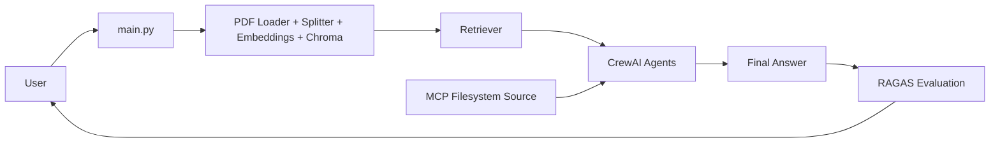
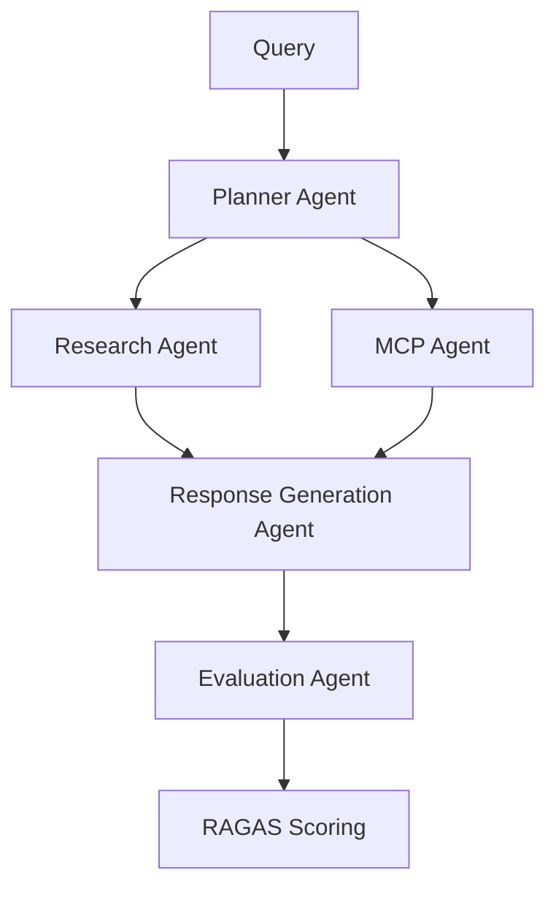

# Project Documentation: Enterprise Knowledge Assistant

## 1) Project Overview
Enterprise Knowledge Assistant is an Agentic AI solution built with CrewAI, RAG, RAGAS, and MCP integration to help employees quickly obtain accurate answers from distributed enterprise knowledge.

## 2) Business Problem
Organizations maintain information across policy documents, repositories, operational systems, and service workflows. Manual lookup is slow and inconsistent. The solution reduces search effort and improves consistency by orchestrating retrieval, synthesis, and evaluation.

## 3) Solution Approach
- Retrieve policy context using RAG over PDF content.
- Run a CrewAI multi-agent workflow to plan, analyze, enrich, and generate answer.
- Pull supplemental operational context from an MCP-integrated filesystem source.
- Evaluate answer quality with RAGAS metrics and interpretation.

## 4) Architecture
### Components
- RAG module (`rag/`)
- CrewAI agents (`agents/`)
- MCP data connector (`mcp/`)
- RAGAS evaluation (`evaluation/`)
- App entry point (`main.py`)

### Architecture Diagram


### Agent Workflow Diagram


## 5) Environment Setup
1. Python 3.10+ recommended
2. Install dependencies:
   ```bash
   pip install -r requirements.txt
   ```
3. Configure environment variables:
   - `OPENAI_API_KEY`
   - `HF_TOKEN` (optional depending on environment)

## 6) Configuration
See `config.py`:
- Chunk size: `500`
- Chunk overlap: `50`
- Vector DB directory: `./chroma_db`
- Retriever top-k: `3`
- PDF source list: `data/company_policies.pdf`
- MCP source file: `data/mcp_enterprise_updates.txt`

## 7) Execution Steps
Run:
```bash
python main.py
```
Choose mode:
- Single custom query
- Sample query batch (repeatable demonstration mode)

## 8) RAG Design
- **Document source**: policy PDF(s)
- **Chunking**: recursive character splitting
- **Embedding**: all-MiniLM-L6-v2
- **Vector database**: Chroma
- **Retrieval output visibility**: printed with source/page tags for traceability

## 9) CrewAI Design
### Agents and Responsibilities
- Planner: decomposes query into evidence needs
- Research: extracts relevant evidence from RAG context
- MCP: extracts supplemental enterprise updates
- Response: synthesizes final answer
- Evaluation: qualitative quality observation

### Task Flow
Plan → Research Evidence → MCP Evidence → Final Response → Quality Note

## 10) MCP Integration
- **Server type**: Filesystem MCP-style integration
- **Tool behavior**: reads enterprise updates file and filters lines relevant to query terms
- **Use case**: enrich policy-based answers with operational updates

## 11) RAGAS Evaluation
Metrics collected:
- Faithfulness
- Answer Relevancy
- Context Precision
- Context Recall

Output includes:
- Numeric metric values
- Automated interpretation (Strong / Moderate / Weak)

## 12) Challenges and Learnings
- Grounding improves with explicit evidence handoffs across agents.
- Supplemental MCP data helps bridge gaps in policy documents.
- Metric-based evaluation gives objective quality feedback for iteration.
